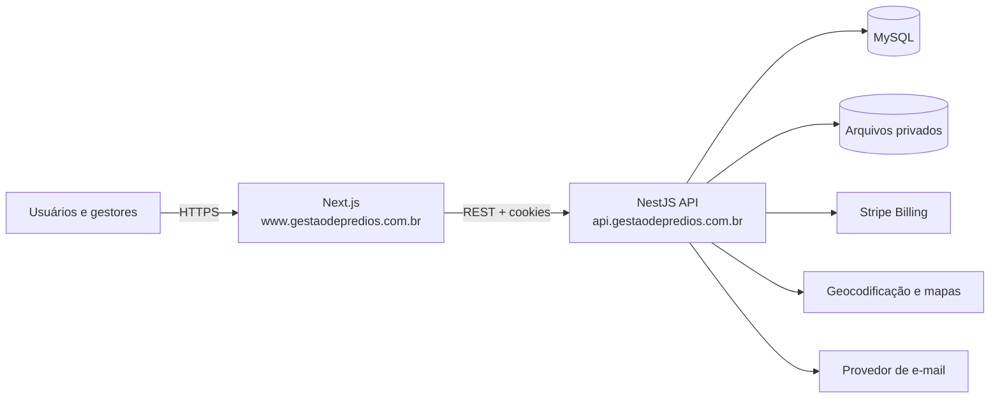
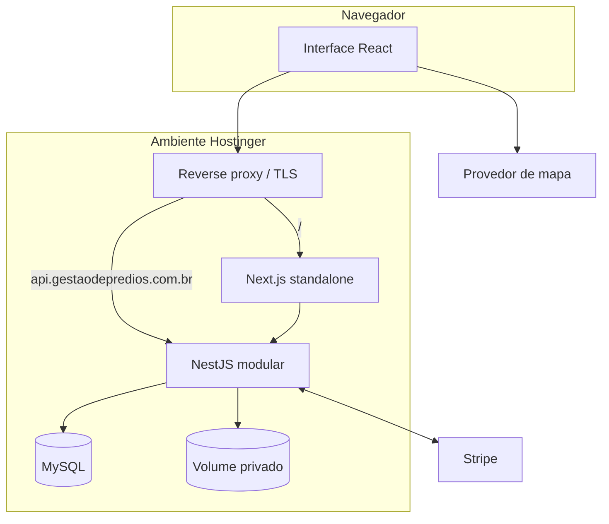
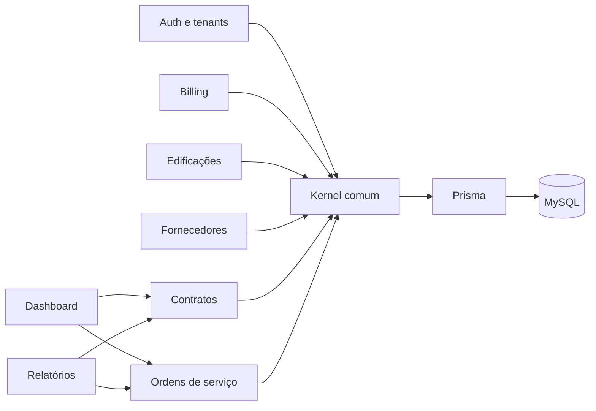
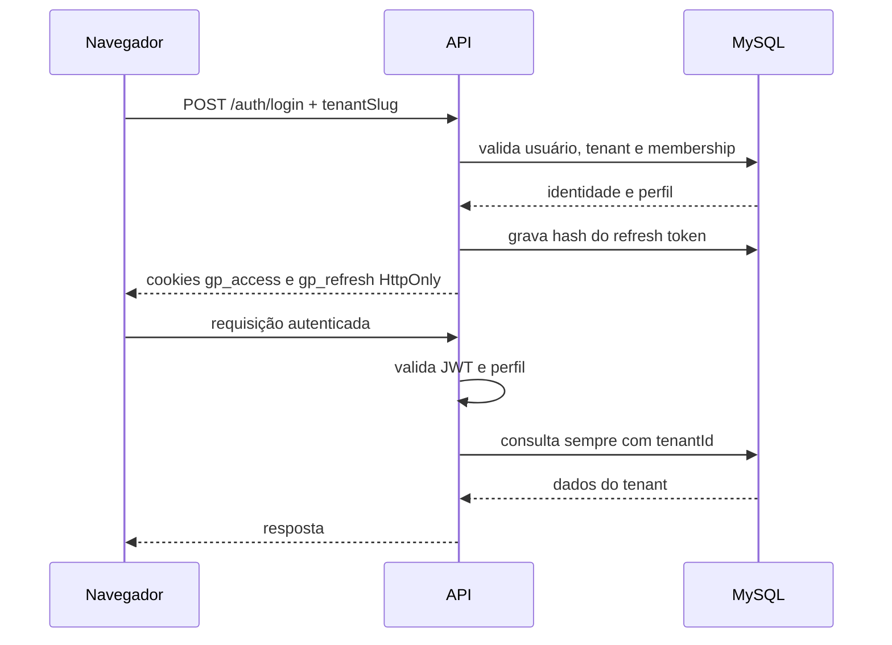
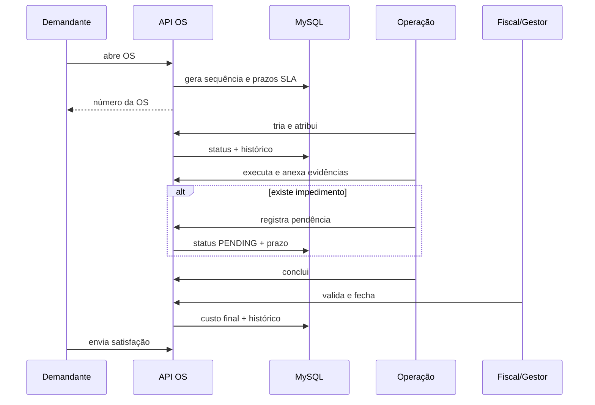

# Arquitetura técnica

## 1. Stack definida

| Camada | Tecnologia |
|---|---|
| Runtime | Node.js LTS |
| Linguagem | TypeScript |
| Frontend | Next.js com React e App Router |
| Backend | NestJS, API REST versionada |
| Banco | MySQL 8 compatível |
| ORM | Prisma ORM |
| Autenticação | JWT curto + refresh token rotativo em cookies HttpOnly |
| Cobrança | Stripe Billing e webhooks verificados |
| Mapas | MapLibre GL com provedor de tiles configurável |
| PDFs | PDFKit no início; motor HTML→PDF pode ser introduzido quando os relatórios exigirem paginação complexa |
| Hospedagem | Hostinger; preferência por VPS com Docker para controle operacional |
| Repositório | monorepo npm workspaces |

## 2. Estilo arquitetural

O produto começa como **monólito modular**. Frontend e API são aplicações separadas no mesmo repositório, enquanto a API possui módulos de domínio independentes. Não há microserviços no MVP.

Benefícios:

- transações simples entre OS, contratos, orçamento e medição;
- menor custo de operação;
- uma única política de autorização;
- migrações e implantação mais previsíveis;
- extração futura de serviços baseada em métricas reais, não em antecipação.

## 3. Diagrama de contexto



E-mail e geocodificação são portas arquiteturais previstas; não estão completos na fundação v0.1.

## 4. Diagrama de contêineres



## 5. Módulos internos da API



Módulos planejados devem seguir o mesmo padrão: controller, DTO, service/use cases, políticas de domínio e testes.

## 6. Camadas da API

1. **Transporte:** controllers HTTP, cookies, códigos de resposta e Swagger.
2. **Aplicação:** casos de uso, autorização contextual e transações.
3. **Domínio:** máquina de estados, fórmulas, invariantes e políticas.
4. **Infraestrutura:** Prisma, Stripe, arquivos, e-mail e geocodificação.

A versão inicial ainda possui alguns acessos de infraestrutura diretamente nos services. O roadmap prevê interfaces para `StoragePort`, `GeocodingPort`, `BillingPort` e `NotificationPort` antes de adicionar novos provedores.

## 7. Autenticação e autorização



- O token de acesso deve ser curto.
- O refresh token é opaco, armazenado apenas em hash e rotacionado.
- O papel pertence ao vínculo usuário–tenant, e não ao usuário global.
- Autorização por perfil não substitui a filtragem por tenant e por objeto.

## 8. Multi-tenancy

Estratégia inicial: **banco e schema compartilhados, linhas segregadas por `tenant_id`**.

Controles obrigatórios:

- `tenantId` deriva do token validado, nunca do corpo da requisição;
- índices compostos começam por `tenantId` nas consultas críticas;
- chaves de negócio são únicas por tenant;
- anexos usam prefixo do tenant no caminho;
- testes de isolamento tentam acessar IDs de outro tenant;
- tarefas administrativas globais são separadas dos papéis internos do cliente.

Uma estratégia de banco por tenant somente deve ser considerada para contratos enterprise com requisito explícito e capacidade operacional correspondente.

## 9. Fluxo central da ordem de serviço



## 10. Arquivos

MVP local:

- arquivos fora da pasta pública;
- chave composta por tenant, entidade e UUID;
- metadados e hash SHA-256 no banco;
- download somente por endpoint autorizado;
- limite de tamanho e lista positiva de MIME types.

Produção recomendada:

- volume persistente com backup ou armazenamento de objetos compatível com S3;
- varredura antimalware;
- URLs temporárias quando o provedor permitir;
- política de retenção e descarte.

## 11. Integração Stripe

- Checkout para contratação online;
- Customer Portal para cartão e cancelamento;
- webhook é a fonte confiável para alterar a assinatura;
- idempotência por `stripe_event_id`;
- assinatura do webhook verificada antes de processar;
- acesso não é liberado pelo retorno visual do Checkout;
- contratos públicos ou corporativos podem usar `MANUAL_CONTRACT`, preservando os mesmos limites de entitlement.

## 12. Relatórios

Relatórios simples podem ser gerados na requisição. Relatórios extensos devem migrar para job persistente com estados `QUEUED/RUNNING/READY/FAILED`, armazenamento privado e expiração. Não se deve introduzir fila antes de haver um processo worker supervisionado.

## 13. Observabilidade

Padrão mínimo para produção:

- logs JSON com `requestId`, `tenantId`, `userId`, rota, status e duração;
- mascaramento de senha, token, cartão e dados pessoais sensíveis;
- health checks de processo, banco e armazenamento;
- alertas de erro de webhook e falha de backup;
- métricas de latência, erro, conexões do banco e tamanho de fila, quando existir.

## 14. Metas técnicas iniciais

São objetivos de engenharia a validar, não garantias comerciais:

- consultas comuns paginadas abaixo de 500 ms no percentil 95 em carga de referência;
- criação e transição de OS transacionais;
- RPO de backup de até 24 horas no MVP e menor para planos enterprise;
- restauração ensaiada periodicamente;
- zero acesso cruzado em testes automatizados de tenancy.

## 15. Estrutura do repositório

```text
apps/
  api/                    NestJS + Prisma
  web/                    Next.js

docs/
  adr/                    decisões arquiteturais

infra/
  nginx/                  reverse proxy

AGENTS.md                 instruções permanentes para Codex/agentes
.env.example              catálogo de variáveis
Dockerfile(s)             implantação reproduzível
```
