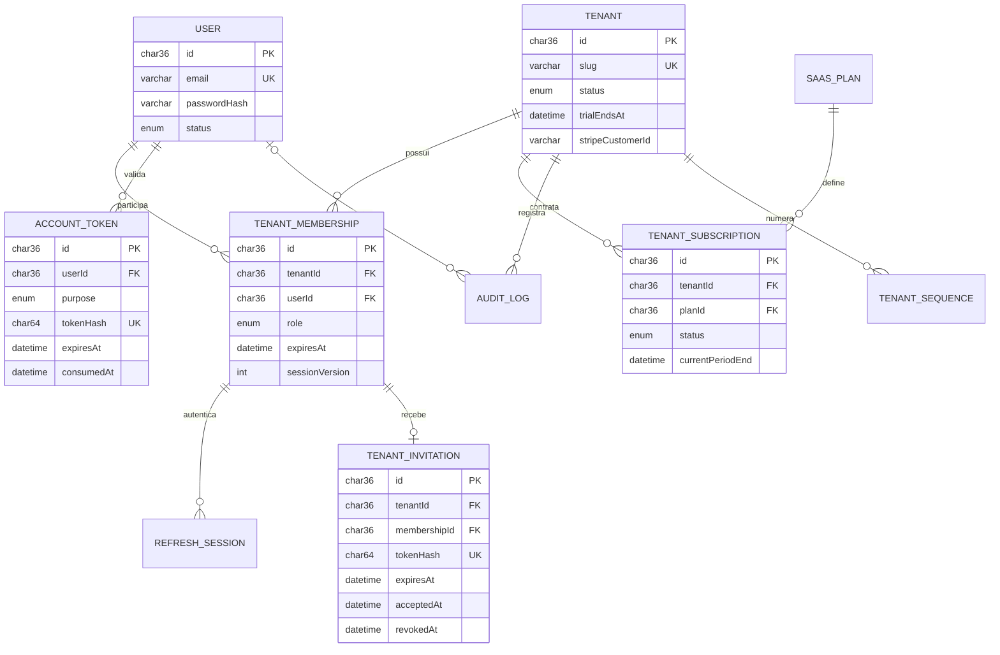
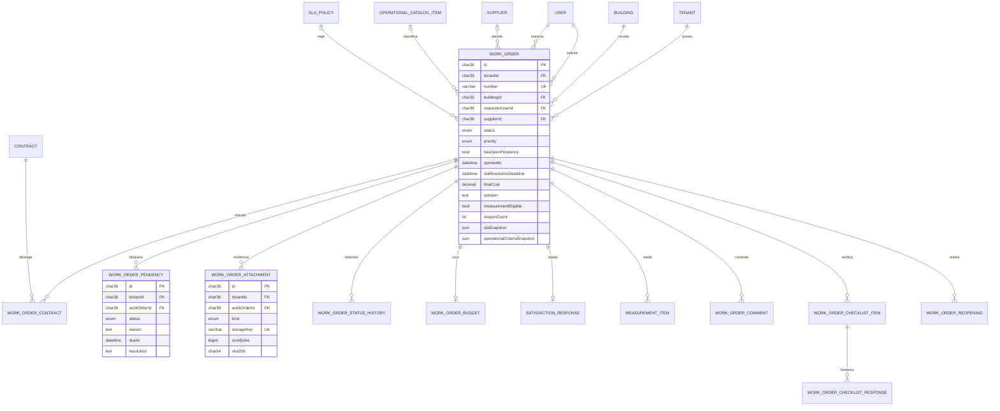
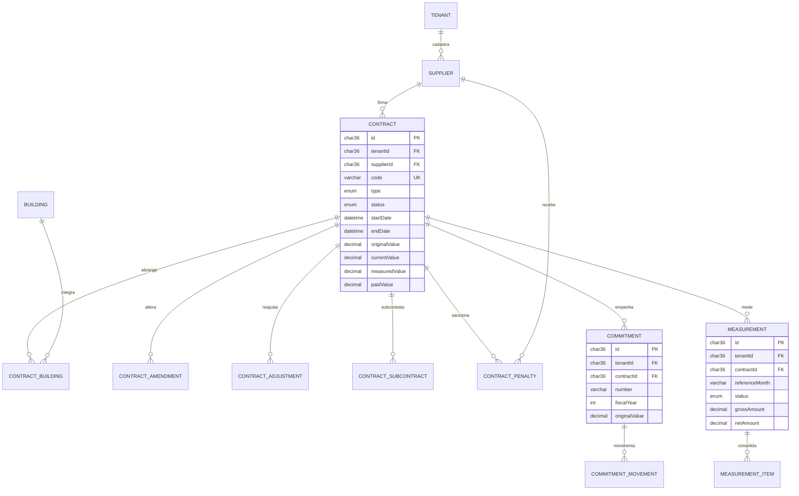
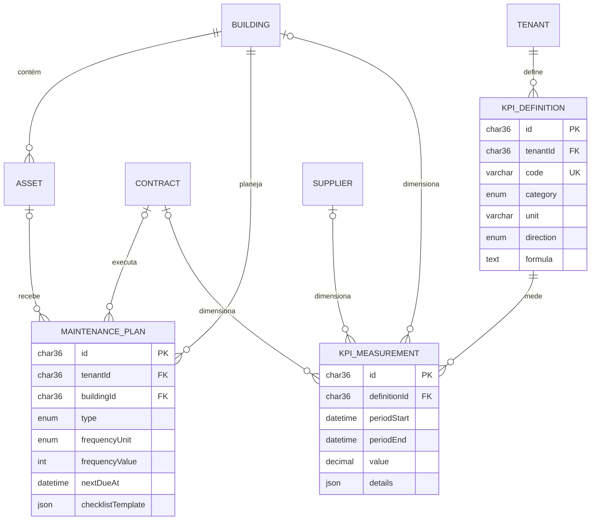

# Modelo e dicionário de dados

## 1. Convenções

- Chaves primárias: UUID armazenado como `CHAR(36)` no início.
- Datas: UTC no banco; apresentação no fuso do tenant.
- Valores: `DECIMAL`, nunca ponto flutuante.
- Exclusão lógica: `deletedAt` nas entidades principais.
- Segregação: entidades de negócio contêm `tenantId` quando precisam de consulta ou validação direta por tenant.
- Nomes no banco permanecem em inglês para consistência técnica; interface e documentação funcional ficam em português.

## 2. Núcleo SaaS

## 3. Núcleo operacional da OS

### 3.1 Extensões operacionais da v0.7

- `OperationalCatalogItem` mantém categorias, especialidades, ambientes e causas por tenant. Categorias carregam prioridade e critérios de evidência, checklist, custo e aceite.
- `ChecklistTemplateItem` define o modelo ativo; `WorkOrderChecklistItem` é o snapshot da OS e `WorkOrderChecklistResponse` é append-only, preservando todas as respostas.
- `SlaCalendar`, `SlaHoliday` e `SlaPolicy` modelam tempo corrido/útil, feriados, múltiplos turnos e precedência tenant/contrato/categoria.
- A OS armazena `slaSnapshot` e `operationalCriteriaSnapshot`, evitando que alterações futuras de configuração mudem seu histórico.
- `WorkOrderComment` e `WorkOrderCommentMention` registram comunicação cronológica sem rotas de edição/exclusão.
- `WorkOrderReopening` preserva motivo, estado, aceite, custos, avaliação e o ciclo completo de SLA do fechamento anterior, além do indicador de reabertura em 30 dias. A avaliação corrente é removida atomicamente na reabertura para que o novo ciclo não reutilize a nota anterior.
- `NotificationPreference`, `Notification` e `NotificationOutbox` implementam preferências, caixa interna e entrega transacional com retry.
- `GeocodingCache` isola por tenant as consultas normalizadas, candidatos e expiração do cache.

## 4. Contratos e financeiro

## 5. Manutenção planejada e indicadores

## 6. Dicionário das entidades centrais

### 5.1 Extensões gerenciais da v0.9

- `Measurement` usa versão otimista e workflow até pagamento; `MeasurementItem` congela a OS,
  valor bruto, dedução e líquido no tenant autenticado.
- `CommitmentMovement` é o razão append-only de emissão, reforço, anulação, liquidação e
  pagamento. Liquidações/pagamentos podem apontar para a medição que os originou.
- `SinapiCatalog` e `SinapiCatalogItem` preservam competência, UF, versão e hash. O item de
  orçamento congela quantidade/custo e `BudgetRevision` guarda cada decisão.
- `MaintenancePlanGeneration` reserva de forma única o par plano/data antes de criar a OS e
  registra geração, skip ou falha.
- `KpiMeasurement.calculationKey` identifica tenant, escopo, período e versão da fórmula,
  tornando o recálculo idempotente.

| Entidade | Responsabilidade | Invariantes principais |
|---|---|---|
| Tenant | organização cliente | slug único; status controla entitlement |
| TenantMembership | papel do usuário no tenant | um vínculo por usuário/tenant; acesso provisório respeita expiração |
| TenantInvitation | convite de entrada na organização | token armazenado somente em hash; uso único; validade de 72 horas; pertence ao tenant e ao vínculo |
| AccountToken | redefinição de senha e verificação de e-mail | token em hash, finalidade explícita, uso único e expiração; nunca armazenar o valor bruto |
| Building | imóvel gerenciado | código único no tenant; coordenadas devem formar par válido |
| Supplier | fornecedor | documento fiscal único no tenant |
| Contract | instrumento contratual | código único; data final posterior à inicial; fornecedor do mesmo tenant |
| WorkOrder | unidade operacional | número único; imóvel e demandante obrigatórios; status segue máquina de estados |
| WorkOrderContract | relação N:N OS–contrato | no máximo um contrato principal por OS, regra a reforçar na aplicação |
| WorkOrderPendency | bloqueio explicitado | motivo obrigatório; resolução registrada; fechamento exige ausência de pendência aberta |
| WorkOrderAttachment | evidência privada | MIME permitido, hash, tamanho e chave privada |
| WorkOrderBudget | orçamento da OS | um orçamento por OS; totais recalculados no servidor |
| Measurement | medição mensal contratual | OS não deve ser paga duas vezes na mesma medição; fechamento por workflow |
| Commitment | empenho | número único por tenant e exercício; saldo deriva dos movimentos |
| MaintenancePlan | regra recorrente | próxima data e periodicidade válidas; geração idempotente |
| KpiDefinition | definição auditável | fórmula, unidade, direção e meta explícitas |

## 7. Índices críticos do backlog

A tabela `WorkOrder` possui índices compostos para:

- tenant + status + abertura;
- tenant + edificação + status + abertura;
- tenant + fornecedor + status + abertura;
- tenant + demandante + status + abertura;
- tenant + pendência aberta + status;
- tenant + prazo SLA + status;
- tenant + prioridade + status.

Antes de criar novos índices, analisar consultas reais com `EXPLAIN` e métricas de produção.

## 7.1 Registros de homologação do GP-044

O piloto não cria uma estrutura operacional paralela. Cada decisão de cenário usa `AuditLog` com
`entityType = PilotHomologation` e o código do cenário em `entityId`; o aceite final usa
`entityType = PilotAcceptance`. Novas decisões são acrescentadas, nunca sobrescritas, e a leitura
considera o registro mais recente do tenant. Exportações também geram auditoria com ator e data.

Como o GP-044 apenas consolida entidades já existentes e usa a trilha append-only, a v0.10.0 não
exige migration nem seed adicional.

## 8. Evoluções previstas do schema

- comentários e menções na OS;
- checklist executado e respostas estruturadas;
- catálogo de categorias, especialidades e causas de falha;
- arquivo genérico para contratos, fornecedores e medições;
- workflow de aprovação;
- notificações e preferências;
- jobs de geração de plano preventivo e relatório;
- documentos de terceirizados com criptografia e retenção reforçadas;
- tabela de baseline de energia/água e leituras por imóvel;
- outbox transacional para eventos externos quando e-mail/webhooks exigirem robustez.
