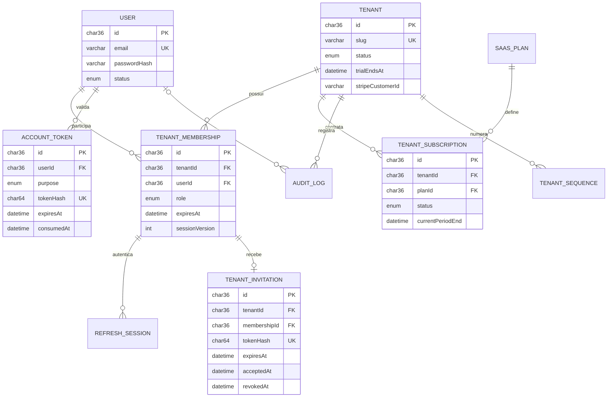
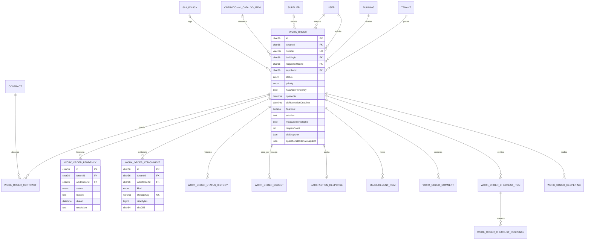
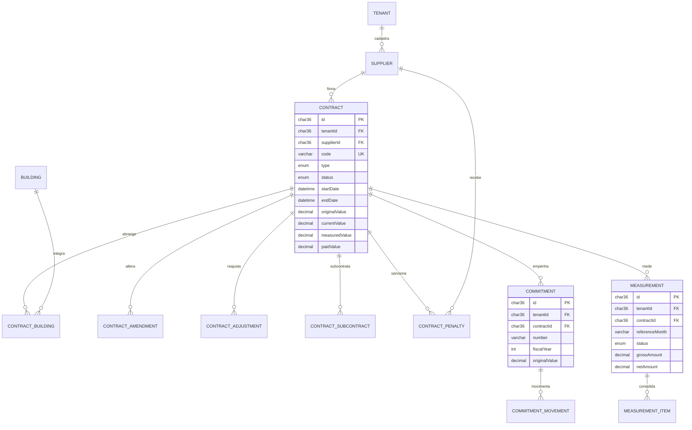
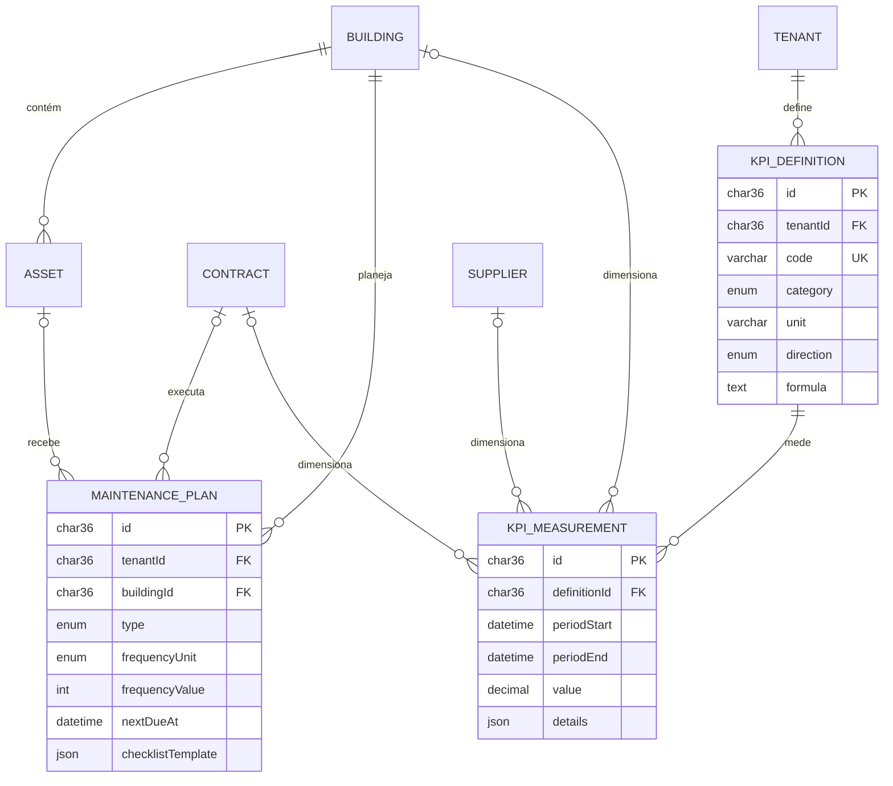

# Modelo e dicionário de dados

## 1. Convenções

- Chaves primárias: UUID armazenado como `CHAR(36)` no início.
- Datas: UTC no banco; apresentação no fuso do tenant.
- Valores: `DECIMAL`, nunca ponto flutuante.
- Exclusão lógica: `deletedAt` nas entidades principais.
- Segregação: entidades de negócio contêm `tenantId` quando precisam de consulta ou validação direta por tenant.
- Nomes no banco permanecem em inglês para consistência técnica; interface e documentação funcional ficam em português.

## 2. Núcleo SaaS

```mermaid
erDiagram
  TENANT ||--o{ TENANT_MEMBERSHIP : possui
  USER ||--o{ TENANT_MEMBERSHIP : participa
  TENANT_MEMBERSHIP ||--o{ REFRESH_SESSION : autentica
  TENANT_MEMBERSHIP ||--o| TENANT_INVITATION : recebe
  USER ||--o{ ACCOUNT_TOKEN : valida
  TENANT ||--o{ TENANT_SUBSCRIPTION : contrata
  SAAS_PLAN ||--o{ TENANT_SUBSCRIPTION : define
  TENANT ||--o{ AUDIT_LOG : registra
  USER o|--o{ AUDIT_LOG : pratica
  TENANT ||--o{ TENANT_SEQUENCE : numera

  TENANT {
    char36 id PK
    varchar slug UK
    enum status
    datetime trialEndsAt
    varchar stripeCustomerId
  }
  USER {
    char36 id PK
    varchar email UK
    varchar passwordHash
    enum status
  }
  TENANT_MEMBERSHIP {
    char36 id PK
    char36 tenantId FK
    char36 userId FK
    enum role
    datetime expiresAt
    int sessionVersion
  }
  TENANT_INVITATION {
    char36 id PK
    char36 tenantId FK
    char36 membershipId FK
    char64 tokenHash UK
    datetime expiresAt
    datetime acceptedAt
    datetime revokedAt
  }
  ACCOUNT_TOKEN {
    char36 id PK
    char36 userId FK
    enum purpose
    char64 tokenHash UK
    datetime expiresAt
    datetime consumedAt
  }
  TENANT_SUBSCRIPTION {
    char36 id PK
    char36 tenantId FK
    char36 planId FK
    enum status
    datetime currentPeriodEnd
  }
```

## 3. Núcleo operacional da OS

```mermaid
erDiagram
  TENANT ||--o{ WORK_ORDER : possui
  BUILDING ||--o{ WORK_ORDER : recebe
  USER ||--o{ WORK_ORDER : solicita
  USER ||--o{ WORK_ORDER : executa
  SUPPLIER o|--o{ WORK_ORDER : atende
  WORK_ORDER ||--o{ WORK_ORDER_CONTRACT : vincula
  CONTRACT ||--o{ WORK_ORDER_CONTRACT : abrange
  WORK_ORDER ||--o{ WORK_ORDER_PENDENCY : bloqueia
  WORK_ORDER ||--o{ WORK_ORDER_ATTACHMENT : evidencia
  WORK_ORDER ||--o{ WORK_ORDER_STATUS_HISTORY : historiza
  WORK_ORDER ||--o{ WORK_ORDER_BUDGET : orca_por_estagio
  WORK_ORDER ||--o| SATISFACTION_RESPONSE : avalia
  WORK_ORDER ||--o{ MEASUREMENT_ITEM : mede
  OPERATIONAL_CATALOG_ITEM o|--o{ WORK_ORDER : classifica
  SLA_POLICY o|--o{ WORK_ORDER : rege
  WORK_ORDER ||--o{ WORK_ORDER_COMMENT : comenta
  WORK_ORDER ||--o{ WORK_ORDER_CHECKLIST_ITEM : verifica
  WORK_ORDER_CHECKLIST_ITEM ||--o{ WORK_ORDER_CHECKLIST_RESPONSE : historiza
  WORK_ORDER ||--o{ WORK_ORDER_REOPENING : reabre

  WORK_ORDER {
    char36 id PK
    char36 tenantId FK
    varchar number UK
    char36 buildingId FK
    char36 requesterUserId FK
    char36 supplierId FK
    enum status
    enum priority
    bool hasOpenPendency
    datetime openedAt
    datetime slaResolutionDeadline
    decimal finalCost
    text solution
    bool measurementEligible
    int reopenCount
    json slaSnapshot
    json operationalCriteriaSnapshot
  }
  WORK_ORDER_PENDENCY {
    char36 id PK
    char36 tenantId FK
    char36 workOrderId FK
    enum status
    text reason
    datetime dueAt
    text resolution
  }
  WORK_ORDER_ATTACHMENT {
    char36 id PK
    char36 tenantId FK
    char36 workOrderId FK
    enum kind
    varchar storageKey UK
    bigint sizeBytes
    char64 sha256
  }
```

### 3.1 Extensões operacionais da v0.7

- `OperationalCatalogItem` mantém categorias, especialidades, ambientes e causas por tenant. Categorias carregam prioridade e critérios de evidência, checklist, custo e aceite.
- `ChecklistTemplateItem` define o modelo ativo; `WorkOrderChecklistItem` é o snapshot da OS e `WorkOrderChecklistResponse` é append-only, preservando todas as respostas.
- `SlaCalendar`, `SlaHoliday` e `SlaPolicy` modelam tempo corrido/útil, feriados, múltiplos turnos e precedência tenant/contrato/categoria.
- A OS armazena `slaSnapshot` e `operationalCriteriaSnapshot`, evitando que alterações futuras de configuração mudem seu histórico.
- `WorkOrderComment` e `WorkOrderCommentMention` registram comunicação cronológica sem rotas de edição/exclusão.
- `WorkOrderReopening` preserva motivo, estado, aceite, custos, avaliação e o ciclo completo de SLA do fechamento anterior, além do indicador de reabertura em 30 dias. A avaliação corrente é removida atomicamente na reabertura para que o novo ciclo não reutilize a nota anterior.
- `NotificationPreference`, `Notification` e `NotificationOutbox` implementam preferências, caixa interna e entrega transacional com retry.
- `GeocodingCache` isola por tenant as consultas normalizadas, candidatos e expiração do cache.

## 4. Contratos e financeiro

```mermaid
erDiagram
  TENANT ||--o{ SUPPLIER : cadastra
  SUPPLIER ||--o{ CONTRACT : firma
  CONTRACT ||--o{ CONTRACT_BUILDING : abrange
  BUILDING ||--o{ CONTRACT_BUILDING : integra
  CONTRACT ||--o{ CONTRACT_AMENDMENT : altera
  CONTRACT ||--o{ CONTRACT_ADJUSTMENT : reajusta
  CONTRACT ||--o{ CONTRACT_SUBCONTRACT : subcontrata
  CONTRACT ||--o{ CONTRACT_PENALTY : sanciona
  SUPPLIER ||--o{ CONTRACT_PENALTY : recebe
  CONTRACT ||--o{ COMMITMENT : empenha
  COMMITMENT ||--o{ COMMITMENT_MOVEMENT : movimenta
  CONTRACT ||--o{ MEASUREMENT : mede
  MEASUREMENT ||--o{ MEASUREMENT_ITEM : consolida

  CONTRACT {
    char36 id PK
    char36 tenantId FK
    char36 supplierId FK
    varchar code UK
    enum type
    enum status
    datetime startDate
    datetime endDate
    decimal originalValue
    decimal currentValue
    decimal measuredValue
    decimal paidValue
  }
  COMMITMENT {
    char36 id PK
    char36 tenantId FK
    char36 contractId FK
    varchar number
    int fiscalYear
    decimal originalValue
  }
  MEASUREMENT {
    char36 id PK
    char36 tenantId FK
    char36 contractId FK
    varchar referenceMonth
    enum status
    decimal grossAmount
    decimal netAmount
  }
```

## 5. Manutenção planejada e indicadores

```mermaid
erDiagram
  BUILDING ||--o{ ASSET : contém
  BUILDING ||--o{ MAINTENANCE_PLAN : planeja
  ASSET o|--o{ MAINTENANCE_PLAN : recebe
  CONTRACT o|--o{ MAINTENANCE_PLAN : executa
  TENANT ||--o{ KPI_DEFINITION : define
  KPI_DEFINITION ||--o{ KPI_MEASUREMENT : mede
  BUILDING o|--o{ KPI_MEASUREMENT : dimensiona
  CONTRACT o|--o{ KPI_MEASUREMENT : dimensiona
  SUPPLIER o|--o{ KPI_MEASUREMENT : dimensiona

  MAINTENANCE_PLAN {
    char36 id PK
    char36 tenantId FK
    char36 buildingId FK
    enum type
    enum frequencyUnit
    int frequencyValue
    datetime nextDueAt
    json checklistTemplate
  }
  KPI_DEFINITION {
    char36 id PK
    char36 tenantId FK
    varchar code UK
    enum category
    varchar unit
    enum direction
    text formula
  }
  KPI_MEASUREMENT {
    char36 id PK
    char36 definitionId FK
    datetime periodStart
    datetime periodEnd
    decimal value
    json details
  }
```

## 6. Dicionário das entidades centrais

### 5.1 Extensões gerenciais da v0.9

- `Measurement` usa versão otimista e workflow até pagamento; `MeasurementItem` congela a OS,
  valor bruto, dedução e líquido no tenant autenticado.
- `CommitmentMovement` é o razão append-only de emissão, reforço, anulação, liquidação e
  pagamento. Liquidações/pagamentos podem apontar para a medição que os originou.
- `SinapiCatalog` e `SinapiCatalogItem` preservam competência, UF, versão e hash. O item de
  orçamento congela quantidade/custo e `BudgetRevision` guarda cada decisão.
- `MaintenancePlanGeneration` reserva de forma única o par plano/data antes de criar a OS e
  registra geração, skip ou falha.
- `KpiMeasurement.calculationKey` identifica tenant, escopo, período e versão da fórmula,
  tornando o recálculo idempotente.

| Entidade | Responsabilidade | Invariantes principais |
|---|---|---|
| Tenant | organização cliente | slug único; status controla entitlement |
| TenantMembership | papel do usuário no tenant | um vínculo por usuário/tenant; acesso provisório respeita expiração |
| TenantInvitation | convite de entrada na organização | token armazenado somente em hash; uso único; validade de 72 horas; pertence ao tenant e ao vínculo |
| AccountToken | redefinição de senha e verificação de e-mail | token em hash, finalidade explícita, uso único e expiração; nunca armazenar o valor bruto |
| Building | imóvel gerenciado | código único no tenant; coordenadas devem formar par válido |
| BuildingInspection | vistoria técnica do imóvel | pertence ao tenant e à edificação; data, tipo e responsável obrigatórios; exclusão lógica |
| BuildingAttachment | laudo, documento ou fotografia privada | MIME e assinatura validados; hash, tamanho e chave privada; download tenant-aware |
| Supplier | fornecedor | documento fiscal único no tenant |
| Contract | instrumento contratual | código único; data final posterior à inicial; fornecedor do mesmo tenant |
| WorkOrder | unidade operacional | número único; imóvel e demandante obrigatórios; status segue máquina de estados |
| WorkOrderContract | relação N:N OS–contrato | no máximo um contrato principal por OS, regra a reforçar na aplicação |
| WorkOrderPendency | bloqueio explicitado | motivo obrigatório; resolução registrada; fechamento exige ausência de pendência aberta |
| WorkOrderAttachment | evidência privada | MIME permitido, hash, tamanho e chave privada |
| WorkOrderBudget | orçamento da OS | um orçamento por OS; totais recalculados no servidor |
| Measurement | medição mensal contratual | OS não deve ser paga duas vezes na mesma medição; fechamento por workflow |
| Commitment | empenho | número único por tenant e exercício; saldo deriva dos movimentos |
| MaintenancePlan | regra recorrente | próxima data e periodicidade válidas; geração idempotente |
| KpiDefinition | definição auditável | fórmula, unidade, direção e meta explícitas |

## 7. Índices críticos do backlog

A tabela `WorkOrder` possui índices compostos para:

- tenant + status + abertura;
- tenant + edificação + status + abertura;
- tenant + fornecedor + status + abertura;
- tenant + demandante + status + abertura;
- tenant + pendência aberta + status;
- tenant + prazo SLA + status;
- tenant + prioridade + status.

Antes de criar novos índices, analisar consultas reais com `EXPLAIN` e métricas de produção.

## 7.1 Registros de homologação do GP-044

O piloto não cria uma estrutura operacional paralela. Cada decisão de cenário usa `AuditLog` com
`entityType = PilotHomologation` e o código do cenário em `entityId`; o aceite final usa
`entityType = PilotAcceptance`. Novas decisões são acrescentadas, nunca sobrescritas, e a leitura
considera o registro mais recente do tenant. Exportações também geram auditoria com ator e data.

Como o GP-044 apenas consolida entidades já existentes e usa a trilha append-only, a v0.10.0 não
exige migration nem seed adicional.

## 8. Evoluções previstas do schema

- comentários e menções na OS;
- checklist executado e respostas estruturadas;
- catálogo de categorias, especialidades e causas de falha;
- arquivo genérico para contratos, fornecedores e medições;
- workflow de aprovação;
- notificações e preferências;
- jobs de geração de plano preventivo e relatório;

## 11. Extensões operacionais v0.12

- `WorkOrderBudget.stage` separa `PLANNED`, `APPROVED` e `FINAL_EXECUTED`; o par OS/estágio é
  único e cada estágio conserva itens, workflow e revisões próprios.
- `MeasurementItem.budgetId` aponta para o orçamento final usado na consolidação, preservando
  rastreabilidade mesmo quando a OS ou o catálogo forem atualizados posteriormente.
- planos recomendados pelo motor registram origem, versão da regra, pontuação de risco e base
  técnica em JSON; a confirmação permanece uma decisão humana auditada.
- documentos de terceirizados com criptografia e retenção reforçadas;
- tabela de baseline de energia/água e leituras por imóvel;
- outbox transacional para eventos externos quando e-mail/webhooks exigirem robustez.

## 12. Gestão por desempenho v0.13

- `KpiDefinition` conserva a biblioteca tenant-scoped e a memória versionada: fórmula, exemplo,
  objetivo, fonte, periodicidade, agregação, metas, faixa aceitável, peso sugerido e critérios de
  glosa/bonificação. Indicadores do sistema não são editados; personalizações criam nova definição.
- `ContractKpi` seleciona o indicador para o contrato e congela meta, peso, papel financeiro, tetos
  e arredondamento. `KpiPerformanceBand` define enquadramento, escore e ajuste por faixa sem apagar
  versões desativadas.
- `KpiDataPoint` recebe leituras auditáveis para fontes ainda não nativas, como disponibilidade,
  consumo, sensores e segurança. O cálculo é automático depois da ingestão e nunca fabrica dado ausente.
- `KpiMeasurement` aceita dimensões de contrato, OS, plano, ativo, edifício e fornecedor, guarda
  fórmula, versão, detalhes, escore normalizado e faixa. A chave de cálculo permanece idempotente.
- `KpiFinancialAdjustment` liga KPI, configuração contratual e medição financeira, preservando base,
  percentual, teto, valor e memória. `KpiAlert` usa chave de deduplicação e registra plano de ação.
- `Measurement` separa deduções manuais, glosas de desempenho, bônus e IGD; o líquido deriva de
  `bruto - deduções + bônus` usando `Decimal`.

## 13. Dossiê patrimonial e vistorias v0.15

- `BuildingInspection` registra o histórico de vistorias por edificação; a data da última
  vistoria é derivada do registro mais recente, evitando duplicação inconsistente no cadastro.
- `BuildingAttachment` armazena laudos em PDF, documentação do imóvel em PDF e fotografias
  JPG/PNG/WebP fora da pasta pública, com hash SHA-256, autoria e download autorizado por tenant.
- O arquivamento da edificação preserva contratos, OS, ativos, documentos e vistorias. Planos
  de manutenção ativos são suspensos na mesma transação e a operação gera auditoria.

## 14. Orçamento contratual e dedicação exclusiva v0.18

`Contract.exclusiveLaborDedication` registra se a execução exige dedicação exclusiva de mão de obra.
O campo é independente do tipo operacional e do regime de execução, pois influencia a composição
de custos e a gestão dos postos, mas não substitui a classificação jurídica do contrato.

O orçamento global do contrato é separado dos três estágios de orçamento de cada OS:

- `ContractBudget`: cabeçalho único por contrato, versão, status e totais reconciliados;
- `ContractBudgetImport`: arquivo-fonte privado, hash SHA-256 e relatório da importação;
- `ContractBudgetSheet`: manifesto de todas as abas, inclusive auxiliares não transformadas em preço;
- `ContractBudgetItem`: materiais, serviços, itens de apoio e referências SINAPI;
- `ContractLaborPost`: posto/profissional, quantitativos, jornada e custos mensal/anual;
- `ContractLaborCostComponent`: módulos e submódulos da formação do preço do posto;
- `ContractBudgetRevision`: fotografia dos totais e contagens após cada alteração.

`BudgetItem.contractBudgetItemId` registra a origem de um item usado na OS. O serviço valida que a
planilha pertence a um contrato efetivamente vinculado à OS e copia o preço vigente para a revisão,
preservando a rastreabilidade mesmo quando o contrato for atualizado depois.

## 15. OrçaPro — catálogo global e projetos privados

ADR 0007 separa o orçamento de obras da OS de manutenção. O catálogo existente `SinapiCatalog`/`SinapiCatalogItem` permanece intacto. As migrations `20261002170000_orcapro_global_sinapi`, `20261002180000_orcapro_user_access` e `20261002183000_orcapro_private_code_length` acrescentam entidades próprias.

| Entidade | Escopo e invariantes |
| --- | --- |
| `OrcaproReference` | Global, UNIQUE ano/mês/revisão; DRAFT/VALIDATED/PUBLISHED/ARCHIVED, checksum, metadata e validação. Publicação é imutável; correção cria revisão. |
| `OrcaproSettings` | Ponteiro `defaultReferenceId` global aplicado apenas à criação de novos projetos. |
| `OrcaproInput`, `OrcaproComposition` | Identidade global UUID/código textual; nenhum tenant/user ou preço atual. |
| `OrcaproInputVersion`, `OrcaproCompositionVersion` | UNIQUE referência/identidade; descrição, unidade, classificação/grupo e FULLTEXT por referência. |
| `OrcaproInputPrice` | UNIQUE referência/insumo/UF/regime (SD/CD/SE); DECIMAL(18,6), NULL distinto de zero. |
| `OrcaproAnalyticItem` | Versão estrutural, posição, insumo **ou** subcomposição, DECIMAL(24,12). CHECK exclusivo do tipo e coeficiente não negativo; FKs dos filhos ON UPDATE RESTRICT compatíveis com CHECK MySQL. |
| `OrcaproProject` | UUID, tenant/owner com FKs User/Tenant RESTRICT, referência fixa, UF/regime, documento privado, versão otimista e arquivamento. |
| `OrcaproProjectVersion` | UNIQUE projeto/versão; snapshot privado/contexto/nome/versão do motor/autoria. Não contém catálogo oficial. |
| `OrcaproTemplate` | Exemplos globais públicos com referência; clonagem copia somente projeto/cadastros privados e registra versão do template. |
| `OrcaproCustomInput`, `OrcaproCustomComposition` | UNIQUE tenant/owner/código/revisão, códigos privados até 60 caracteres, revisões imutáveis. Composição guarda proveniência oficial quando verificável. |
| `OrcaproImport`, `OrcaproAudit` | Relatório/checksum/autoria e trilha append-only das mudanças. Logs globais somente em administração explícita. |
| `OrcaproUserAccess` | Habilitação por usuário exclusivamente OrçaPro; `managed` distingue novas contas com licença obrigatória; `deletedAt` permite exclusão recuperável. Não altera User.status ou TenantMembership.role. Administração global usa UUIDs autorizados em configuração server-side separada. |

O domínio impede ciclos e referências analíticas ausentes no mesmo mês/revisão. O custo é calculado pelo contexto referência × UF × regime com escala/truncagem preservadas; não há `currentPrice`. Contextos faltantes mantêm NULL e eventual fallback SP sinalizado. Dados históricos oficiais não desaparecem: FKs RESTRICT, arquivamento e restauração de snapshots com referências arquivadas.

Campos extensos BDI/IVA/EAP/cronogramas/memórias permanecem no documento privado durante a migração incremental. Todo snapshot é validado, restringe cadastros a CP-/IP-, IDs seguros, vínculos e revisões numéricas; a raiz e o contexto são canonizados no servidor. Salvar snapshot antigo não reverte biblioteca privada. Cotações/itens de outra base preservam códigos/custos/memórias, sem cadastro SINAPI artificial. Histórico com origem não verificável é marcado LEGACY_UNVERIFIED.

Toda consulta operacional OrçaPro inclui tenant e proprietário autenticados; consultas globais SINAPI não recebem tenant. Imports/publicação/default/clonagem/snapshots usam transações. O contrato e evidências detalhados estão em [orcapro-api.md](orcapro-api.md).

## Análises de riscos OrçaPro no documento versionado

`OrcaproProject.data.risks` guarda análises privadas de Monte Carlo/tornado na forma `{v:1,analyses:[]}`, incluindo fotografia, contexto referência × UF × regime, SHA-256, premissas, semente, resumo, versão do motor e memória do BDI anterior/novo. Usa `OrcaproProjectVersion` e `OrcaproAudit` existentes; não cria tabela, migration ou catálogo SINAPI por usuário. Campo gerenciado exclusivamente pelas rotas de riscos. Custos da fotografia são strings de centavos; contingência e taxa final são reconciliadas com Decimal. [Detalhes e rollback](orcapro-risks.md).

## 16. Administração SaaS e assinatura individual OrçaPro

Migration aditiva `20261002193000_orcapro_saas_management`, conforme [ADR 0008](adr/0008-orcapro-assinatura-individual.md).

| Modelo/campo | Invariante |
| --- | --- |
| `TenantMembership.maintenanceAccess` | Default true preserva vínculos existentes. Cadastro administrativo OrçaPro cria vínculo REQUESTER com false; login não concede acesso à manutenção. |
| `OrcaproPlan` | Código global único, MONTH/YEAR, DECIMAL(12,2) BRL, preço Stripe único opcional, ativo e versão otimista. Plano sem preço Stripe funciona no controle manual. |
| `OrcaproSubscription` | UNIQUE userId: uma licença individual exclusiva OrçaPro em todos os vínculos da conta. Tenant de origem identifica contratação/auditoria; não autoriza acesso a orçamentos de outros tenants. Status/período/plano efetivos separados de stripeStatus/stripePeriodEnd. |
| `OrcaproStripeEvent` | Identificador de evento único e processedAt; deduplicação na transação da licença. Não replica payload financeiro. |

O cliente Stripe da assinatura individual é distinto do cliente da organização usado pela manutenção. `billingSource=MANUAL` preserva decisão manual quando webhook atualiza o estado externo. SYNC explícito retoma fonte STRIPE. Cancelamento de renovação externa não cancela automaticamente um contrato manual. Eventos consultam o estado remoto atual após lock da assinatura; checkout tem idempotência e uma sessão aberta por usuário. `version` impede alterações perdidas.

Contas anteriores sem assinatura e sem managed preservam acesso. Cadastro administrativo recebe teste individual de 30 dias; nenhum plano pago é criado automaticamente. ACTIVE/MANUAL_CONTRACT admitem validade futura ou sem vencimento; TRIALING exige fim futuro; vencimento e inadimplência bloqueiam rotas operacionais, preservando a área de renovação. Administradores globais configurados são protegidos e dispensados de licença comercial.

Todas as criações de identidade pelas rotas de registro, cadastro e convite da manutenção também criam managed=true e teste individual de 30 dias, sem modificar o contrato da manutenção. Vincular uma conta já existente não reinicia seu período. Novas rotas de criação de User devem preservar managed=true e licença explícita; ausência de licença/grant fica reservada às contas anteriores e fixtures de seed, sem abrir um cadastro alternativo com acesso comercial ilimitado. O cadastro online exclusivo usa a licença pendente descrita abaixo.

O cadastro online exclusivo OrçaPro é uma contratação pendente: cria `managed=true`, tenant próprio
com slug gerado no servidor, vínculo REQUESTER com `maintenanceAccess=false` e assinatura individual
`UNPAID`, `billingSource=STRIPE`, sem período gratuito. Não cria `TenantSubscription` da manutenção.
Somente o webhook válido (ou uma concessão manual auditada) libera o orçamento. Falha posterior do
Checkout preserva a conta para retomada autenticada. Email único e transação impedem duplicatas e
tenants órfãos. O login por email usa o tenant de origem da licença, sem troca arbitrária de organização.
Nenhuma alteração de schema é necessária para esse fluxo. Espelhar o banco não autoriza compartilhar
cobranças: chaves, preços, eventos e recursos Stripe devem corresponder ao TEST/LIVE de cada ambiente.
O Portal do Cliente também pode usar uma configuração exclusiva por ambiente, identificada pela
variável `ORCAPRO_STRIPE_PORTAL_CONFIGURATION_ID`, sem nova tabela nem mudança na configuração
padrão da conta Stripe. O serviço confere o modo e a atividade da configuração e da sessão retornada.
`ORCAPRO_ONLY=true` na API comercial bloqueia o cadastro público da manutenção antes de qualquer
mutação. O flag não altera linhas espelhadas, memberships históricos, senhas ou concessões manuais;
o desenvolvimento com os dois programas mantém `ORCAPRO_ONLY=false`.

Exclusão é lógica no acesso OrçaPro: preserva User, memberships, catálogo e orçamentos. Senha é compartilhada; redefinição administrativa invalida todos os JWT/refresh e tokens de recuperação da conta, com auditoria sem senha/hash. Tenant CANCELED representa cobrança da manutenção: contas OrçaPro contratadas podem autenticar com maintenanceAccess efetivo false. SUSPENDED/DELETED organizacional continua bloqueando ambos.

## 17. OrçaPro Infraestrutura — MySQL independente

[ADR0009](adr/0009-infraestrutura-banco-independente-identidade-compartilhada.md) fixa banco separado em `INFRA_DATABASE_URL`; não há migration destas tabelas no Prisma principal. `apps/api/infraestrutura-migrations/001_infraestrutura.sql` é aplicada pelo CLI com ledger `InfraMigration(name,sha256,applied_at)`. Alterar uma migration já aplicada interrompe a execução. O driver recusa o banco principal como destino.

| Entidade | Escopo e invariantes |
| --- | --- |
| `InfraUser` | Perfil local UNIQUE usuário externo/tenant, ADMIN/USER e ACTIVE/PENDING/BLOCKED. Apenas IDs/metadados centrais; sem senha. `deleted_at` recuperável e `erasure_requested_at` distingue pedido LGPD de bloqueio administrativo. |
| `InfraCycle` | Global SICRO, UNIQUE fonte/UF/referência; DRAFT/PUBLISHED/ARCHIVED, hash/tamanho/autoria, estado de importação, relatório e exemplo. Publicado imutável. |
| `InfraCycleChunk` | Staging global por ciclo/seq; SHA-256 e bytes UTF-8 do fragmento. Reenvio idêntico, exclusão após conferência. |
| `InfraCycleSnapshot`, `InfraPemSnapshot` | Gzip global imutável e ETag do JSON servido; raw SICRO/PEM íntegros, sem cópias por usuário. |
| `InfraCycleInput` | Código/classificação/unidade e preços SD/CD/SE DECIMAL(24,8), NULL distinto de zero; documento original complementar. |
| `InfraCycleComposition` | Estrutura por ciclo/código; produção/FIC DECIMAL e custo oficial contextual de comparação. Não há preço corrente universal. |
| `InfraCycleItem` | Linhas A/B/C/D/E/T/X, seq, código referenciado e coeficiente DECIMAL(30,12), documento bruto preservado. |
| `InfraCycleEquipmentPart`, `InfraCycleTransportItem`, `InfraCycleCharge` | Demonstrativos de equipamento SD/CD, transportes e encargos globais associados ao ciclo. |
| `InfraPem` | Ficha global por ciclo e código real da composição PEM; nomes compartilhados na validação/snapshot, não duplicados em cada ficha. |
| `InfraProject` | UUID, proprietário+tenant, FK ciclo RESTRICT, UF/regime, BDI DECIMAL e documento20MB; versão otimista e lixeira. Não compartilha projetos entre usuários do mesmo tenant. |
| `InfraProjectVersion` | UNIQUE projeto/versão; snapshot/contexto gzip privado, autoria e retenção100versões padrão. Restore cria nova versão. |
| `InfraOwnRecord` | UNIQUE usuário/tenant/tipo/código, INPUT/COMPOSITION, documento privado e revisão otimista; não altera o catálogo global. |
| `InfraSetting` | Preferências privadas por usuário/tenant/nome. |
| `InfraPolicy` | Termos/privacidade globais do produto, texto/versionamento/editor administrativo. |
| `InfraAudit` | Eventos locais, ator/tenant, entidade e payload sem segredos. Expurgo LGPD anonimiza conteúdo e referências pessoais de seu escopo. |
| `InfraLoginAttempt` | Bucket HMAC, janela/contadores/bloqueio/datas; não persiste e-mail/IP em claro. Expurgo de buckets inativos por sete dias, preservando bloqueios vigentes. |

Os IDs centrais são referências externas sem FKs entre bancos. O servidor valida User/TenantMembership centrais antes de conceder perfil. Nova identidade recebe `maintenanceAccess=false` e `OrcaproUserAccess(managed=true,enabled=false)`, preservando licenças independentes. A mudança de senha e revogação central incluem `AuditLog` transacional; perfil/password não são duplicados.

As datas DATETIME/TIMESTAMP deste banco são UTC. O adapter Infraestrutura converte parâmetros `Date` em texto SQL UTC e lê datas SQL como instantes UTC explícitos, inclusive dentro de transações; isso evita conversões pelo fuso local do processo no MariaDB3.5.3. A mesma leitura é usada pelos CLI, sem alterar o fuso global do Node ou o adapter do banco principal.

O raw é a entrada exata do motor legado; colunas DECIMAL normalizadas servem consulta e conferência, sem substituir escalas, arredondamento ou custos ausentes do original. Projetos históricos mantêm ciclo fixo; migração compara versões e cria nova revisão. Snapshot de catálogo nunca é incorporado a cada usuário/projeto. Somente dados próprios aparecem no documento privado.

Exclusão ordinária usa lixeira. Pedido expresso de eliminação LGPD encerra acesso local e, após30dias por padrão, o CLI remove projetos/versões/próprios/configurações/perfil e anonimiza auditoria. Preserva outro tenant do mesmo usuário, identidade central, outros produtos e catálogo global. Backups anteriores expiram em14dias. Esse descarte específico é documentado e não autoriza exclusão física genérica dos produtos existentes. [Contratos/limites](infraestrutura-api.md), [migrations/rollback](infraestrutura-deploy.md).
