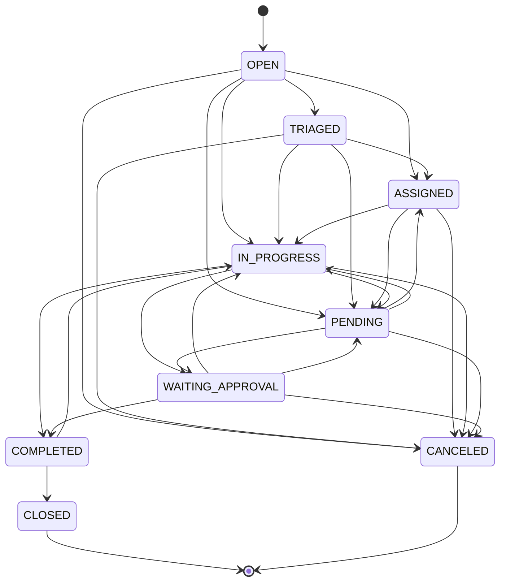

# Regras das ordens de serviço

## 1. Papel no domínio

A ordem de serviço é o agregado central do sistema. Ela conecta demanda, imóvel, contrato, fornecedor, execução, evidências, custo, medição e percepção do usuário. Qualquer módulo novo deve declarar como se relaciona com a OS ou justificar por que é exclusivamente cadastral/administrativo.

## 2. Identificação

Formato inicial:

```text
OS-{ANO}-{SEQUENCIAL_DE_6_DÍGITOS}
Exemplo: OS-2026-000137
```

A sequência é independente por tenant e ano. A emissão deve ocorrer na mesma transação da atualização da sequência.

## 3. Campos obrigatórios na abertura

- edificação;
- demandante;
- título;
- descrição;
- prioridade;
- origem;
- data de abertura;
- usuário criador.

Contrato, fornecedor e responsável pela execução podem ser definidos na triagem, mas o sistema deve destacar OS sem definição operacional.

## 4. Estados e transições



### Significado

| Estado | Significado |
|---|---|
| OPEN | demanda registrada, ainda sem triagem concluída |
| TRIAGED | escopo e prioridade revisados |
| ASSIGNED | fornecedor ou responsável definido |
| IN_PROGRESS | execução iniciada |
| PENDING | há impedimento formal registrado |
| WAITING_APPROVAL | execução aguarda validação, aceite ou autorização |
| COMPLETED | executor declarou conclusão |
| CLOSED | responsável competente validou e encerrou |
| CANCELED | demanda anulada com justificativa |

`COMPLETED` e `CLOSED` são distintos: conclusão é declaração operacional; fechamento é aceite e encerramento gerencial.

## 5. Pendências

Ao registrar uma pendência:

1. motivo é obrigatório;
2. prazo e responsável são recomendados e poderão se tornar obrigatórios por política do tenant;
3. o status da OS passa para `PENDING`;
4. o status anterior é preservado;
5. `hasOpenPendency` torna-se verdadeiro para permitir consulta rápida;
6. a OS não pode ser fechada enquanto houver pendência aberta.

Ao resolver a última pendência, a OS retorna ao status anterior. Se o anterior também era `PENDING`, retorna para `IN_PROGRESS`.

Categorias futuras recomendadas: acesso ao local, material, autorização, informação do demandante, fornecedor, segurança, orçamento e causa externa.

## 6. Backlog

Considera-se backlog toda OS nos estados:

- `OPEN`;
- `TRIAGED`;
- `ASSIGNED`;
- `IN_PROGRESS`;
- `PENDING`;
- `WAITING_APPROVAL`.

`COMPLETED` não integra o backlog operacional de execução, mas deve aparecer em fila separada de aceite para evitar conclusão sem fechamento.

### Faixas de envelhecimento

- 0 a 2 dias;
- 3 a 7 dias;
- 8 a 15 dias;
- 16 a 30 dias;
- mais de 30 dias.

As faixas devem ser configuráveis em versão posterior. A idade é calculada desde `openedAt`, sem subtrair períodos pendentes no indicador bruto. Um segundo indicador pode medir tempo líquido quando o SLA admitir suspensão formal.

## 7. Dimensões analíticas obrigatórias

Toda consulta gerencial de backlog deve admitir, isolada ou conjuntamente:

- fornecedor;
- edificação;
- demandante;
- contrato;
- prioridade;
- status;
- pendência;
- prazo vencido;
- período de abertura;
- idade;
- categoria/especialidade, após implantação do catálogo;
- responsável operacional, após implantação do diretório de equipes.

## 8. SLA

A fundação calcula prazos padrão por prioridade. Esses valores são apenas configuração inicial e devem migrar para uma tabela por tenant, contrato, categoria e calendário.

Exemplo inicial:

| Prioridade | Resposta | Resolução |
|---|---:|---:|
| Baixa | 24 h | 120 h |
| Normal | 8 h | 72 h |
| Alta | 4 h | 24 h |
| Urgente | 1 h | 8 h |
| Crítica | 15 min | 4 h |

Evoluções obrigatórias:

- calendário útil ou corrido;
- feriados e jornadas;
- SLA específico por contrato;
- suspensão justificada;
- primeiro atendimento e solução definitiva;
- alertas antes do vencimento;
- registro de violação e causa.

## 9. Contratos e fornecedores

- Uma OS pode relacionar-se a vários contratos.
- Um vínculo deve ser marcado como principal.
- O fornecedor direto pode ser preenchido para facilitar a análise, mas deve ser consistente com o contrato principal quando existir.
- Valores alocados por contrato permitem dividir uma OS entre instrumentos distintos.
- A medição deve considerar somente vínculos elegíveis e aprovados.

## 10. Anexos

Tipos iniciais:

- foto antes;
- foto durante;
- foto depois;
- nota fiscal em PDF;
- relatório técnico;
- cotação;
- outro documento.

Regras:

- JPG, PNG, WebP e PDF na fundação;
- nota fiscal obrigatoriamente PDF;
- fotografias obrigatoriamente imagem;
- armazenamento privado;
- nome original preservado apenas como metadado;
- hash para integridade e detecção de duplicidade futura;
- download auditado;
- exclusão lógica e política de retenção.

## 11. Fechamento

Critérios mínimos recomendados para fechar:

- status `COMPLETED`;
- nenhuma pendência aberta;
- descrição da solução;
- evidência de conclusão conforme a categoria;
- custo final, quando aplicável;
- responsável pelo aceite;
- checklist obrigatório concluído;
- indicação de elegibilidade para medição.

A fundação exige apenas a transição e a ausência de pendência. Os demais critérios devem ser adicionados no MVP antes de uso produtivo crítico.

## 12. Reabertura

A fundação permite `COMPLETED → IN_PROGRESS`; uma OS já `CLOSED` é terminal. O MVP deve criar operação explícita de reabertura, com autorização, motivo, contador e vínculo com o evento anterior. Reabertura em até 30 dias alimenta o indicador de qualidade.

## 13. Satisfação

Após `COMPLETED` ou `CLOSED`, o demandante pode registrar:

- nota de 1 a 5;
- NPS de 0 a 10;
- comentário.

Para fins gerenciais, CSAT e NPS não devem ser misturados. O relatório sempre informa número de respostas e taxa de participação.

## 14. Medição

Uma OS somente deve integrar medição quando:

- estiver concluída ou fechada conforme a política;
- houver contrato elegível;
- custo/quantidade estiver aprovado;
- documentação obrigatória estiver presente;
- não tiver sido incluída de forma incompatível em outra medição.

A consolidação deve preservar o vínculo da medição com cada OS e permitir auditoria reversa.

## 15. Critérios de aceite do núcleo OS

- numeração sem colisão em concorrência;
- transições inválidas rejeitadas;
- fechamento com pendência rejeitado;
- filtros por todas as dimensões essenciais;
- anexos de outro tenant inacessíveis;
- histórico imutável por operações comuns;
- relatório de backlog reproduz os filtros;
- testes de estado e isolamento multi-tenant automatizados.
